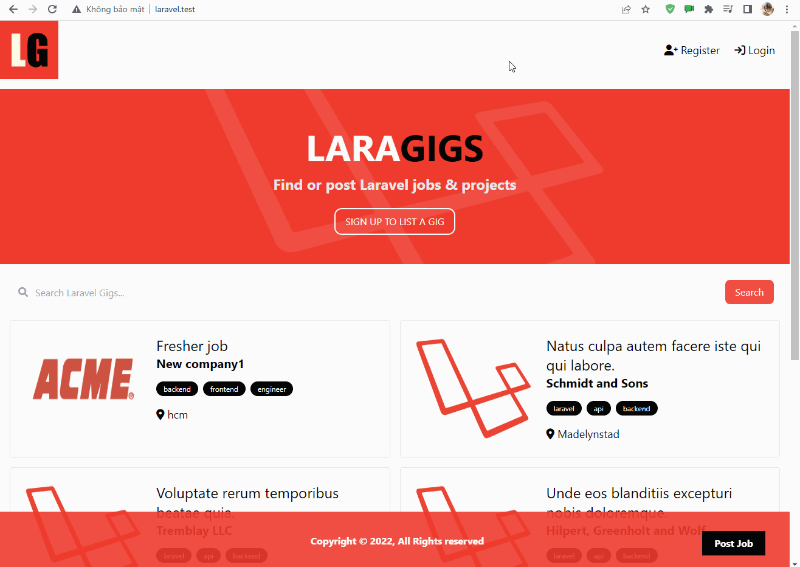

# Description
Project website: using laravel for creating this website
(guide from Traversy Media, [link](https://www.youtube.com/watch?v=MYyJ4PuL4pY) )

# Index content
* [General info](#general-info)
* [Technologies](#technologies)
* [Feature](#feature)
* [Demo](#demo)

# General info
- This is my personal project when I learn about to Laravel
- With guide, tutorial I learn from Travesy Media, and from my knowledged when I were student in University 
- This project is a Job posting website, can Post new job, can view job's posting, can registry a new account and post job, can manage job list

# Technologies
- This project has been created based on Laravel Framework with MVC model
- Has using alpine.js for flash message
- MySQL is the database Im using.

# Feature
- Register: user can register new account for posting new Job
- Posting new job: user after register or after logged will post a new job's post with their account
- Manage list job posting: user can edit/delete your posting job.
- Search: user/viewer can search, select tag from job for filter job list output

# Demo
- Register:  
 
 
- Posting new job:  
 
 
- Manage list job:  
 
 
- Search:  
 

